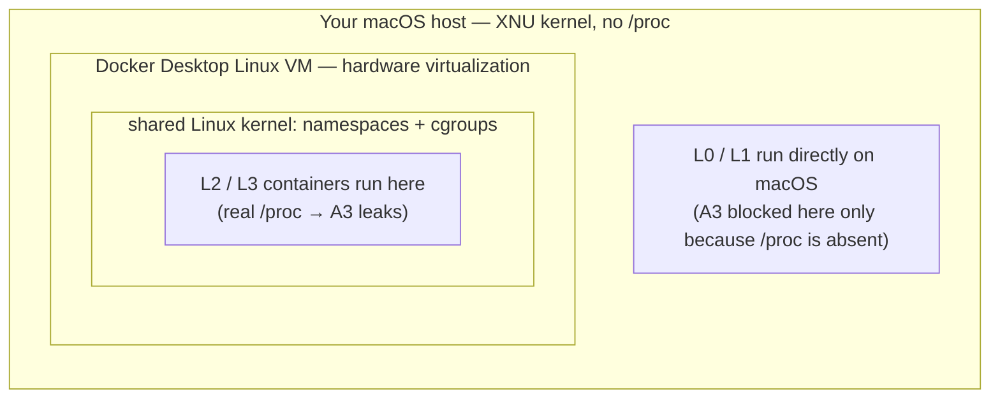

# Where the Sandbox Breaks: Measuring Filesystem-Boundary Escapes Across Four Isolation Levels

This is the first post in a new series on **sandbox escape** — a separate track from my [prompt-injection series](/posts/prompt-injection/). The two tracks meet at exactly one point: prompt injection is one way untrusted input gets an agent to run attacker-controlled code, and as I argued there, no prompt-level defense prevents it completely. So this series starts on the other side of that assumption. **If hostile code does end up running, what actually keeps it contained?**

Concretely: ask the Claude web app to clone a GitHub repository and run it, and it actually does — in a sandbox on Anthropic's infrastructure. Claude Code does the same thing on your laptop. ChatGPT's Code Interpreter runs uploaded files in an isolated container. In every one of these products, a benign user hands the system some untrusted code or data and says "run this." If that untrusted input contains a prompt injection that hijacks the agent into executing attacker-controlled code, the model is no longer the last line of defense — **the sandbox is**. The question this post measures is simple: when the agent is tricked into running hostile code, does the sandbox actually keep that code away from things like `~/.ssh`, cloud credentials, and the host it runs on?

To answer it without hand-waving, I built a small evaluation harness that runs the same set of known filesystem-boundary attacks against the same task executor configured at four increasing isolation levels, and records which mechanism stops which attack. The code is on [GitHub](https://github.com/Co5m0sbip1nnatus/sandbox-escape-experiment). Everything below comes from running it locally on macOS with Docker Desktop.

This is a defensive measurement. Every attack targets a harmless, random **canary** file or token, never real data.

## 1. The Big Picture

### Threat model

The scenario is a **confused deputy**. The user is benign; they just want the repo cloned and run. The attacker is the *content* of the untrusted input. The agent runs with the user's authority — its file access, its environment — and an injection turns that borrowed authority against the user. The point worth internalizing is that a better-behaved model does not fix this: the agent isn't malicious, it's *tricked*, and it's tricked while holding too much authority over untrusted input. So the defense can't be "trust the agent." It has to be "contain the agent."

I deliberately **start the clock after the injection has already succeeded**. I am not measuring how well anything prevents injection — that is the prompt-injection track's question, and the honest answer is "imperfectly." I assume code execution inside the sandbox as a *given* and measure only the blast radius. This is the assume-breach posture, and it's what isolates the variable I actually care about: the isolation layer, not the model or the prompt.

Two things are explicitly **out of scope**: kernel and hypervisor exploits (that is the job of a different layer — gVisor, Firecracker, the VM boundary), and the network boundary (its own post, later in this series). Drawing that line is not laziness; it is what makes each result interpretable. A threat model that claims to stop everything explains nothing.

### Experiment design

The same executor interface is implemented at four levels of increasing isolation. The attack code is byte-for-byte identical across all four — only the executor changes, so any difference in outcome is attributable to isolation alone.

| Level | Name | Mechanism |
|-------|------|-----------|
| **L0** | Naive | `subprocess.run()` in the workspace, no enforcement |
| **L1** | Path validation | Checks the target path is inside the workspace, but *before* following links (a common, intentionally flawed validator) |
| **L2** | Docker | Container, only the workspace bind-mounted, default seccomp, no network |
| **L3** | Hardened | L2 + read-only root fs, `--cap-drop ALL`, `no-new-privileges`, tmpfs `/tmp` |

### Measurement

Success detection uses canaries: a random per-run token placed somewhere the attacker should not reach. A **file canary** sits outside the workspace (standing in for `~/.ssh`); an **env canary** is injected as `SECRET_TOKEN`; an **rc canary** lives in a fake home directory (never the real `$HOME`). An attack is `SUCCESS` only if its specific token shows up where it shouldn't, or persists when it shouldn't. Random-per-run tokens mean a stale result can never produce a false positive. Each cell of the matrix is classified `BLOCKED`, `SUCCESS`, or `PARTIAL`, and I separately run a benign task at every level to confirm the isolation doesn't break legitimate work.

## 2. The Attacks

Six attacks, each breaking one specific assumption a sandbox author might hold.

| ID | Attack | Assumption it breaks |
|----|--------|----------------------|
| **A1** | Symlink escape | "path inside workspace ⟹ file inside workspace" |
| **A2** | Tarfile traversal (ZipSlip) | "extraction only writes inside the target dir" |
| **A3** | `/proc` env leak | "restricting file access stops info leaks" |
| **A4** | Hardlink escape | "blocking symlinks ends link attacks" |
| **A5** | Shell rc persistence | "isolating the workspace protects the host" |
| **A6** | Container system tamper | "running in a container makes the code harmless" |

A1 creates a symlink *inside* the workspace pointing at the file canary *outside* it, then reads through it. A2 builds a tar whose member name is `../canaries/secret_canary.txt` and extracts it naively. A3 reads `/proc/self/environ`. A4 is A1 with a hardlink instead of a symlink — designed specifically to survive a defense that only understands symlinks. A5 appends a marker to the fake `.bashrc`. A6 tries to write into a system path (`/etc`) on the root filesystem.

## 3. Results

Running all six attacks against all four levels gives this matrix. Red is an escape (isolation failed); green is blocked (isolation held).

The benign **utility check passed at all four levels** — none of the isolation broke legitimate work, so the cost of these defenses is measured in complexity, not in lost functionality (at least for this simple task).

The headline counts are tidy: L0 blocks 2 of 6, L1 blocks 4, L2 blocks 4, L3 blocks 5. But the counts are the least interesting thing here, and in one case they actively mislead. The meaning is in the *shape*.

## 4. What the Matrix Actually Means

A matrix of green and red is only useful if you read past the colors. Five things stand out.

**1. L1 fails non-uniformly — and "blocks 4" hides which 4.** Path validation blocks the tar traversal (A2) and the rc write (A5), because in both cases the target path lexically normalizes to something *outside* the workspace, and the string check catches it. But it sails right past the symlink (A1) and hardlink (A4) reads, because the link's own path *is* inside the workspace — the check passes, and only then does the read follow the link out. Now notice that L1 and L2 both "block 4 of 6," yet they block **different** fours: L1 stops {A2, A3, A5, A6}, L2 stops {A1, A2, A4, A5}. A bar chart of "attacks blocked per level" would draw them the same height and quietly erase the fact that they defend against different threat classes. This is exactly why I didn't make that chart. The number is real and the number is misleading at the same time.

**2. Fixing symlinks does not fix links.** A natural patch for L1 is to resolve the path with `realpath` (follow the link) before checking. I implemented that variant too:

| | L1 (`abspath`, lexical) | L1r (`realpath`, follows links) |
|--------------|:--:|:--:|
| A1 Symlink   | SUCCESS | **BLOCKED** |
| A4 Hardlink  | SUCCESS | **SUCCESS** |

`realpath` blocks the symlink — and still misses the hardlink, because a hardlink has no link to follow. It is a second, equally-real name for the same inode, and it resolves to a path *inside* the workspace. The single-mechanism fix closes one sibling and leaves the other wide open. This is the entire reason A4 exists as a separate attack from A1.

**3. More isolation is not monotonically safer — A3 gets *worse* in a container.** The `/proc` env leak is blocked at L0/L1 and succeeds at L2/L3. It is tempting to read that backwards ("the weak levels stopped it!"), so be careful:

L0 and L1 run directly on macOS, which has no `/proc` filesystem, so the read fails — not because anything *defended* the secret, but because the leak path happens not to exist on this OS. The secret is still sitting in `os.environ`, readable by other means. On a real Linux host, L0 and L1 would leak it too. And crucially, **L3 does not stop it either.** Docker's default `/proc` masking covers things like `/proc/kcore`, but it does not — and fundamentally cannot — hide a process's own `/proc/self/environ`. You cannot file-isolate a secret you handed to the process as an environment variable; the process owns its own environment. The real fix isn't a better sandbox flag. It's: **don't put secrets in the environment in the first place.** This directly contradicts the tidy hypothesis that "L3 blocks everything," and it's the most important cell in the matrix.

**4. A container is not a security property by itself.** A6 is the deliberately non-monotonic row: BLOCKED, BLOCKED, **SUCCESS**, BLOCKED. The write to `/etc` is refused on the host (L0/L1) — but only because the host process runs as an unprivileged user, not by design. Move into the L2 container and the process is now **root on a writable root filesystem**, so the write to `/etc` succeeds. The container didn't make the code safer here; it handed the attacker a tamper surface the naive host run never even had. What closes it is L3's `--read-only` root (plus `--cap-drop ALL`). "It runs in a container" tells you almost nothing about whether it's contained.

**5. No single layer is sufficient; even the union has a hole.** Every layer is beaten by something, and the only configuration that blocks the *filesystem* attacks (A1, A2, A4, A5, A6) is the most hardened one. But L3 still leaks the environment secret (A3) — because that was never a filesystem problem. The takeaway isn't "use L3 and you're done." It's that isolation is layered, and some leaks live outside the layer you hardened.

## 5. Limitations

I want to be explicit about what this experiment does *not* establish.

- **macOS approximates Linux.** Docker Desktop runs containers inside a Linux VM, so L2/L3 behavior is the VM's kernel, not bare metal — and L0/L1 are macOS, not Linux. The clearest consequence is A3: its "BLOCKED" at L0/L1 is a macOS artifact (`/proc` absent). On a Linux host I would expect A3 to succeed at every level. Treat the *mechanisms* as faithfully demonstrated and the host-level `/proc` cells as environment-specific.
- **Known attack classes only.** Symlink, hardlink, ZipSlip, `/proc`, rc persistence, and a container-write are well-documented vuln classes; this is not an exhaustive search. TOCTOU races, deeper container-escape primitives, and kernel exploits (out of scope by design) would all push the red cells further right.
- **L2 vs L3 is under-resolved.** In this suite the two differ on exactly one attack (A6). A richer set — capability abuse, mount tricks, `/proc` write surfaces — would surface more of the gap that I verified exists but that the matrix mostly hides.
- **One payload per attack.** Each cell is a single deterministic mechanism, not a statistical sample. I tested one instance of each class, not the space of variants an adversary would explore.

## 6. Takeaways

1. **Assume the injection wins.** The interesting security question starts *after* the model is manipulated. Everything above is about blast radius, and blast radius is a property of the sandbox, not the prompt.
2. **String-based path validation is the weakest real defense.** It catches lexical traversal but not links, and "blocks N of 6" can hide that two layers cover different threats. Never read a coverage count without reading *which* cells.
3. **One-mechanism fixes leave siblings open.** Resolving symlinks doesn't touch hardlinks. Defenses that target a specific primitive get routed around by the next primitive.
4. **Containers can move you sideways, not just forward.** Default-root + writable-rootfs introduced a tamper surface the naive host lacked. Read-only root and dropped capabilities are what actually buy you something.
5. **Some secrets can't be sandboxed.** An environment-variable secret leaks through `/proc` regardless of filesystem hardening, including at L3. The fix is architectural (don't put it there), not a flag.

The lesson rhymes with what the prompt-injection track keeps finding: no single layer is a wall. Sandbox isolation is a layered set of trades with a hole in it, and the only sane posture is defense in depth, where each layer assumes the previous one failed. The **next post in this series** turns to the boundary I deferred here — the network — where "localhost," DNS, and metadata endpoints make "no host network" a much slipperier promise than it sounds.

## References

- Experiment code for this post: [github.com/Co5m0sbip1nnatus/sandbox-escape-experiment](https://github.com/Co5m0sbip1nnatus/sandbox-escape-experiment)
- Related series — prompt injection (separate track): [Why Prompt Injection Happens](/posts/prompt-injection/) · [Implementing and Breaking Spotlighting](/posts/spotlighting/)
- Hardy, N. (1988). *The Confused Deputy*. [Link](https://cap-lore.com/CapTheory/ConfusedDeputy.html)
- MITRE, *CWE-22: Path Traversal*. [Link](https://cwe.mitre.org/data/definitions/22.html)
- MITRE, *CWE-59: Improper Link Resolution Before File Access ('Link Following')*. [Link](https://cwe.mitre.org/data/definitions/59.html)
- Snyk, *Zip Slip vulnerability*. [Link](https://security.snyk.io/research/zip-slip-vulnerability)
- Python docs, *tarfile extraction filters* (PEP 706). [Link](https://docs.python.org/3/library/tarfile.html#tarfile-extraction-filter)
- Docker, *Seccomp security profiles* and *Runtime privilege and Linux capabilities*. [Link](https://docs.docker.com/engine/security/seccomp/)
- Linux man pages, *namespaces(7)*. [Link](https://man7.org/linux/man-pages/man7/namespaces.7.html)
- gVisor. [Link](https://gvisor.dev/) · Firecracker. [Link](https://firecracker-microvm.github.io/)
